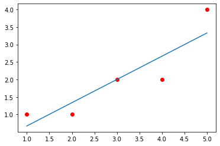

# Partie 1 Régression simple


```python
import pandas as pd
import numpy as np
import matplotlib.pyplot as plt
```

Représentation des phénomènes
en réalité en vue de comprendre
le fonctionnement,

Marketing direct en ligne:
construire un modèle pour identifier les
clients les plus susceptibles d’acheter des
produits de leur prochain catalogue

Clients identifiés par le modèle comme
ayant peu de chance d’acheter seront
exclu de la prochaine liste d’envoi.

## La corrélation

Statistique descriptive de la relation entre X et Y: variation
conjointe.

## 1. La covariance

 ###  Dans l’échantillon:


### Estimation pour la population:


### Covariance et nuage de points


## 2. Le coefficient de corrélation linéaire

« de Pearson »


## Modèle


### L’estimation des paramètres

#### a? b?
Méthode d’estimation: les moindres carrés:


```python
dict_ = {'x':[1, 2, 3, 4, 5], 'y': [1, 1, 2, 2, 4]}
df = pd.DataFrame(dict_, dtype=np.float64)

fn_carree = lambda x: x**2
fn_prod = lambda x, y: x*y

df['x_carree'] = np.vectorize(fn_carree)(df.x)
df['y_carree'] = np.vectorize(fn_carree)(df.y)
df['xy'] = np.vectorize(fn_prod)(df.y, df.x)
df
```


<div>
<style scoped>
    .dataframe tbody tr th:only-of-type {
        vertical-align: middle;
    }

    .dataframe tbody tr th {
        vertical-align: top;
    }

    .dataframe thead th {
        text-align: right;
    }
</style>
<table border="1" class="dataframe">
  <thead>
    <tr style="text-align: right;">
      <th></th>
      <th>x</th>
      <th>y</th>
      <th>x_carree</th>
      <th>y_carree</th>
      <th>xy</th>
    </tr>
  </thead>
  <tbody>
    <tr>
      <th>0</th>
      <td>1.0</td>
      <td>1.0</td>
      <td>1.0</td>
      <td>1.0</td>
      <td>1.0</td>
    </tr>
    <tr>
      <th>1</th>
      <td>2.0</td>
      <td>1.0</td>
      <td>4.0</td>
      <td>1.0</td>
      <td>2.0</td>
    </tr>
    <tr>
      <th>2</th>
      <td>3.0</td>
      <td>2.0</td>
      <td>9.0</td>
      <td>4.0</td>
      <td>6.0</td>
    </tr>
    <tr>
      <th>3</th>
      <td>4.0</td>
      <td>2.0</td>
      <td>16.0</td>
      <td>4.0</td>
      <td>8.0</td>
    </tr>
    <tr>
      <th>4</th>
      <td>5.0</td>
      <td>4.0</td>
      <td>25.0</td>
      <td>16.0</td>
      <td>20.0</td>
    </tr>
  </tbody>
</table>
</div>


```python
b1 = np.sum( df.x*df.y - len(df)*np.mean(df.x)*np.mean(df.y)) / (np.sum( df.x**2 - len(df)*np.mean(df.x)**2 ))
```


```python
b0 = np.mean(df.y) - b1*np.mean(df.x)
```


```python
b0
```


    0.00588235294117645


```python
my_model = lambda x: b1*x + b0
```


```python
my_model(1)
```


    0.6705882352941176


```python
plt.plot(df.x, my_model(df.x))
plt.scatter(df.x, df.y, c="r")
```


    <matplotlib.collections.PathCollection at 0x253f1d21af0>


    

    


```python
residus = df.y - np.mean(my_model(df.x))
residus
```


    0   -1.0
    1   -1.0
    2    0.0
    3    0.0
    4    2.0
    Name: y, dtype: float64


```python
vr = np.mean(residus**2)
residus
```


    0   -1.0
    1   -1.0
    2    0.0
    3    0.0
    4    2.0
    Name: y, dtype: float64


```python
vt = np.sum((df.y - np.mean(df.y))**2 )
vt
```


    6.0


```python
ve = vt - vr
```


```python
ve
```


    4.8


```python
F = (ve/1)/(vr/(len(df)-2))
```


```python
F
```


    12.0


```python

```


```python

```
